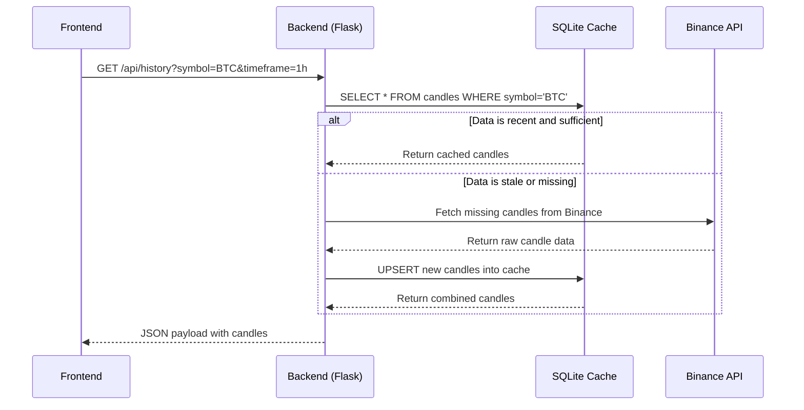
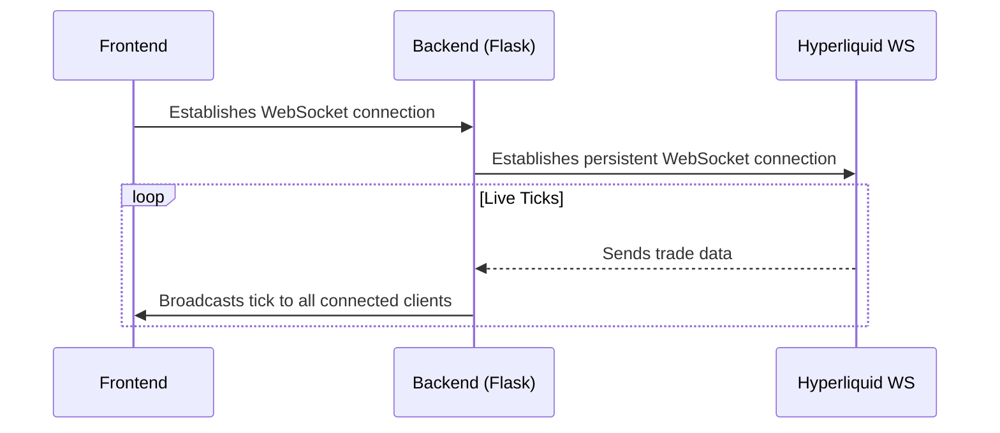
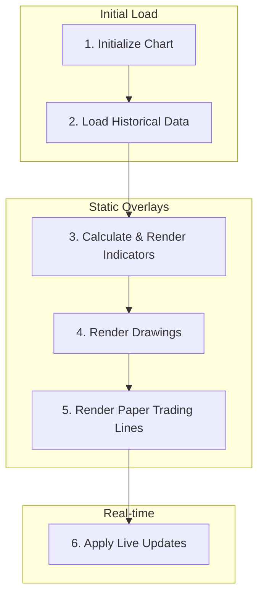
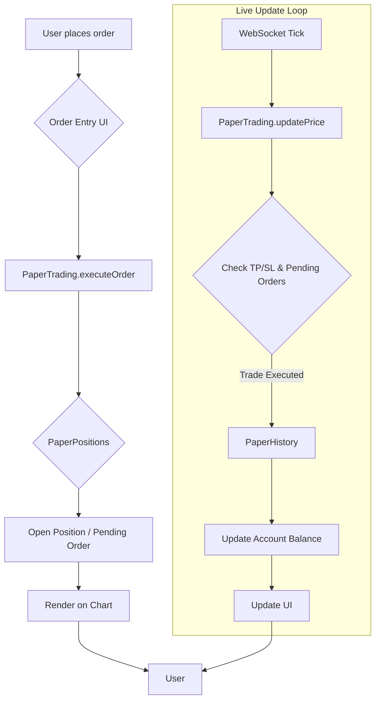

# Architecture Documentation

This document provides a comprehensive overview of the Trading Dashboard's architecture, from high-level system design to the specifics of each major component.

## 1. Project Overview

The Trading Dashboard is a high-performance, browser-based charting application designed for financial market analysis. It runs entirely locally, combining a Python/Flask backend for data processing with a vanilla JavaScript frontend for a responsive user experience.

### Primary Goals
- **Performance**: Deliver a smooth, real-time charting experience without requiring a heavy client-side framework.
- **Modularity**: Enable easy extension with new data sources, indicators, and strategies.
- **Self-Containment**: Run locally without dependencies on cloud services, external accounts, or API keys for core functionality.

### Major Capabilities
- **Multi-Chart Grid**: Display 1, 2, 4, 6, or 8 charts in a resizable grid layout.
- **Real-Time Charting**: Live price updates via WebSocket connections to Hyperliquid and Binance.
- **Technical Indicators**: A suite of standard indicators (SMA, EMA, BB, RSI, VWAP, ATR) calculated and rendered on the client.
- **Advanced Charting Tools**:
  - **Volume Profile (VPVR)**: Visible range volume profile rendered on the canvas.
  - **Session Bands**: Visual overlays for Asia, London, and New York trading sessions.
- **Drawing Toolkit**: A complete set of drawing tools, including trendlines, Fibonacci retracements, and position tools, built using the Lightweight Charts Primitive API.
- **Paper Trading**: A full-featured, browser-based paper trading module with position management, order history, and performance analytics, using "OHM" as the virtual currency.
- **Market Replay**: A powerful tool to select any point in a chart's history and replay the market tick-by-tick, with full trading and analysis capabilities.
- **Strategy Backtesting**: A backend engine to test predefined trading strategies (e.g., SMA Crossover, RSI) against historical data and view performance reports.

---

## 2. High-Level System Architecture

The application follows a classic client-server model, with a clear separation of concerns between the frontend (presentation and interaction) and the backend (data fetching and processing).

```mermaid
graph TD
    subgraph User
        A[Browser]
    end

    subgraph "Frontend Application (Vanilla JS)"
        B[Chart Manager]
        C[Drawing Engine]
        D[Paper Trading Module]
        E[Market Replay Engine]
        F[Indicator Engine]
        G[UI/State Management]
    end

    subgraph "Backend API (Python/Flask)"
        H[API Router]
        I[Historical Data Service]
        J[Backtesting Engine]
        K[Live Data Gateway]
    end

    subgraph "Data & Storage"
      L[SQLite Database]
      M[Browser localStorage]
    end

    subgraph "External Services"
        N[Binance API]
        O[Hyperliquid API/WebSocket]
        P[CoinGecko API]
    end

    A --> G
    G --> B
    B --> F
    B --> C
    B --> D
    B --> E
    
    B --> H
    
    H --> I
    H --> J
    
    I --> L
    I --> N
    
    K --> O
    
    G --> M

    linkStyle 10 stroke:#3b82f6,stroke-width:2px
    linkStyle 11 stroke:#3b82f6,stroke-width:2px
    linkStyle 12 stroke:#3b82f6,stroke-width:2px
    linkStyle 13 stroke:#3b82f6,stroke-width:2px
```

### Layers
1.  **Frontend Application**: A pure JavaScript application responsible for all rendering, user interaction, and state management. It communicates with the backend via REST API calls for historical data and maintains persistent WebSocket connections for live updates.
2.  **Backend API**: A Flask server that acts as a gateway and processor. It serves the frontend files, fetches data from external sources, caches it in a local SQLite database, and runs complex computations like strategy backtests.
3.  **Data & Storage**:
    - **SQLite**: The backend uses a local SQLite database (`market_data.db`) as a persistent cache for historical candle data, significantly speeding up subsequent loads.
    - **localStorage**: The frontend uses the browser's `localStorage` to persist user preferences, including chart layouts, drawings, paper trading state, and theme settings.
4.  **External Services**: The backend connects to public APIs and WebSockets from Binance, Hyperliquid, and CoinGecko to source market data.

---

## 3. Frontend Architecture

The frontend is built with vanilla JavaScript, HTML, and CSS, intentionally avoiding heavy frameworks to maximize performance and control.

### Initialization (`initializeApp` in `script.js`)
1.  **Load State**: Reads settings from `localStorage` (theme, chart count, layouts, drawings, paper trading data).
2.  **Load Dependencies**: Asynchronously loads script files like `indicators.js` and the `paper-trading` suite.
3.  **Connect Sockets**: Establishes WebSocket connections to Binance and Hyperliquid for live data streams.
4.  **Render Grid**: Creates the chart grid based on the loaded count.
5.  **Initialize Charts**: For each pane in the grid, it creates a Lightweight Charts instance, loads its historical data, and restores its indicators and drawings.

### Component Responsibilities
-   **`script.js`**: The main application controller. It manages the global `state` object, handles the chart grid lifecycle, orchestrates data loading, and serves as the central hub for all other modules.
-   **`toolbar.js`**: Manages the state of the drawing toolbar. It communicates the selected tool to the `DrawingManager`.
-   **`drawing-primitives.js`**: Defines the custom drawing objects (e.g., `TrendlinePrimitive`, `FibonacciPrimitive`) that implement the Lightweight Charts Primitive API. This file contains the core rendering logic for each drawing tool.
-   **`paper-trading.js`**: A self-contained module that builds the UI for the paper trading panel and manages all related logic, including the `PaperAccount`, `PaperPositions`, and `PaperHistory` classes.

### State Management
A single global `state` object in `script.js` holds the entire application state, including:
-   `state.charts`: An object containing the state for each chart pane (symbol, interval, series objects, cached data).
-   `state.drawings`: A nested object storing all user-created drawings, keyed by symbol.
-   `state.paperTrading`: The instance of the paper trading module.
-   `state.backtest`: The results of the last backtest run.

This centralized state is persisted to `localStorage` via dedicated functions like `saveLayoutState()` and `saveDrawings()`.

### Chart Lifecycle
1.  **Creation**: `createChartPane()` builds the HTML structure.
2.  **Initialization**: `initializeChart()` creates the Lightweight Charts instance and attaches all series (candles, volume, indicators).
3.  **Data Loading**: `loadChartData()` fetches historical data from the backend.
4.  **Synchronization**: `syncChartWithCache()` applies the fetched data to all relevant series.
5.  **Live Update**: `handlePriceUpdate()` receives WebSocket ticks and updates the last candle in real-time.

---

## 4. Backend Architecture

The backend is a lightweight Flask web server designed for simplicity and efficiency.

### Request Lifecycle
1.  A request hits one of the `@app.route` decorators in `app.py`.
2.  The corresponding function is executed (e.g., `history_api`).
3.  Input parameters (symbol, interval) are validated.
4.  The request is dispatched to the appropriate service, typically in `data_source.py`.
5.  The data handler (`fetch_hyperliquid`) first queries the local SQLite database.
6.  If data is stale or missing, it fetches updates from the external Binance/Hyperliquid API.
7.  New data is inserted/updated in the SQLite cache (`INSERT OR REPLACE`).
8.  The final data is returned to the Flask route as a JSON payload.

### Key Modules
-   **`app.py`**: The entry point. Defines all API routes (`/api/*`), serves the frontend static files, and manages the live data stream fan-out.
-   **`data_source.py`**: A pluggable data abstraction layer. It contains a registry of available data sources and a generic `get_historical_data` function that dispatches requests to the correct handler. This makes adding new data sources (e.g., other exchanges) trivial.
-   **`hyperliquid_handler.py`**: Contains the logic for fetching data from Binance (for historical candles) and streaming live trades from Hyperliquid's WebSocket. It also manages the SQLite database connection and caching logic.
-   **`backtesting_engine.py`**: A class-based engine that uses `pandas` to run strategy simulations on historical data. It is completely decoupled from the rest of the application and operates purely on data inputs.

---

## 5. Data Flow

### Historical Data Flow


### Live Data Flow


---

## 6. Chart Rendering Pipeline

The process of displaying a single chart involves several sequential stages, ensuring data is layered correctly.



1.  **Initialize Chart**: `initializeChart()` creates the chart object and adds all necessary series objects (candlestick, volume, SMAs, EMAs, etc.).
2.  **Load Historical Data**: `loadChartData()` fetches a large chunk of historical data from the backend. This data is stored in `chartData.cachedData`.
3.  **Calculate & Render Indicators**: Functions like `calculateSMA()` and `calculateRSI()` process the `cachedData`. The results are then applied to the indicator series objects via `series.setData()`.
4.  **Render Drawings**: `restoreDrawings()` and `restorePrimitiveDrawings()` iterate through the saved drawings for the current symbol and render them on the chart using either Price Lines or the Primitive API.
5.  **Render Paper Trading Lines**: `paperTrading.updatePositionLines()` draws lines for open positions and pending orders.
6.  **Apply Live Updates**: The WebSocket handler calls `applyPriceUpdate()`, which updates the last candle in `cachedData` and pushes the single-candle update to the chart via `series.update()`. This is highly efficient and avoids full re-renders.

---

## 7. WebSocket Architecture

The backend maintains persistent WebSocket connections to external services to receive live data, which it then broadcasts to all connected frontend clients.

-   **Services**: Hyperliquid and Binance WebSockets are used for real-time trade data.
-   **Backend Module**: `hyperliquid_handler.py` contains the `HyperliquidLiveStream` class, which manages the connection lifecycle in a separate thread.
-   **Frontend Consumption**: The main `script.js` establishes its own WebSocket connection to the backend's `/api/live` endpoint.
-   **Data Flow**:
    1.  The backend's `HyperliquidLiveStream` receives a trade tick.
    2.  It calls the `broadcast_live_tick` function in `app.py`.
    3.  This function iterates through all connected frontend clients and puts the tick data into their respective queues.
    4.  The frontend's `liveStream.onmessage` event fires, calling `handlePriceUpdate`.
    5.  `handlePriceUpdate` identifies the correct chart(s) and updates their data.

---

## 8. Indicator Architecture

All technical indicators are calculated and rendered on the **client-side** within `script.js`.

-   **Calculation**: Each indicator has a dedicated calculation function (e.g., `calculateSMA`, `calculateRSI`). These functions take the full `cachedData` array as input and return an array of `{ time, value }` objects suitable for a Lightweight Charts line series.
-   **Rendering**: Each indicator is rendered on its own `LineSeries` or `HistogramSeries` object. This allows for independent styling (color, thickness) and visibility toggling.
-   **Subcharts**: Indicators like RSI and ATR are rendered in sub-panes by assigning them to a separate price scale and using `scaleMargins` to position them at the bottom of the chart area. `updateSubchartMargins` dynamically adjusts the layout to accommodate multiple sub-charts.
-   **Refresh Logic**: Indicators are fully recalculated whenever the underlying `cachedData` changes (e.g., on initial load, timeframe switch). For live updates, "latest value" calculation functions (e.g., `calculateLatestSMA`) are used to efficiently compute only the value for the newest candle, avoiding a full recalculation on every tick.

---

## 9. Drawing Engine

The drawing engine leverages the **Lightweight Charts Primitive API**, allowing for fully custom, interactive drawings on the chart canvas.

-   **Core Module**: `drawing-primitives.js` defines a base `DrawingBase` class and specific classes for each tool (e.g., `TrendlinePrimitive`, `LongPositionPrimitive`).
-   **How It Works**:
    1.  Each primitive class defines a `renderer` which contains the `draw` method.
    2.  The `draw` method uses the `target.useMediaCoordinateSpace` scope to access the raw HTML5 canvas context.
    3.  It converts time/price coordinates to pixel (X/Y) coordinates using `timeToX()` and `series.priceToCoordinate()`.
    4.  It then uses standard canvas drawing commands (`ctx.lineTo`, `ctx.fillRect`, etc.) to render the shape.
-   **Interaction**:
    -   The `DrawingManager` in `script.js` handles user interactions like clicks and drags.
    -   It identifies which drawing or handle is being interacted with (`_findHandle`).
    -   It translates mouse movements back into time/price coordinates (`_screenToChart`).
    -   It updates the primitive's internal state (e.g., `primitive.setP2(...)`).
    -   The primitive requests an update, triggering a re-render with the new coordinates.
-   **Persistence**: After a drawing is created or modified, its properties (type, points, color) are serialized into a plain object and saved to `localStorage` via `savePrimitiveDrawing`. `restorePrimitiveDrawings` reconstructs the drawings on load.

---

## 10. Paper Trading Architecture

The paper trading system is a comprehensive, self-contained module that operates entirely on the **frontend**.



-   **Core Classes**:
    -   `PaperAccount`: Manages the account balance ("OHM" currency).
    -   `PaperPositions`: Manages open positions and pending limit orders.
    -   `PaperHistory`: Stores a log of all closed trades.
-   **Execution Flow**:
    1.  User fills out the order form in the "TRADE" sidebar tab.
    2.  `executeOrder` is called, creating either a market position or a pending limit order in `PaperPositions`.
    3.  `updatePositionLines` renders the new position/order on the chart.
    4.  On every live price tick, `updatePrice` is called.
    5.  `positions.checkLimits` and `checkTPSL` see if any pending orders or TP/SL levels have been hit.
    6.  If a trade is executed or closed, it is moved from `PaperPositions` to `PaperHistory`, the account balance is updated, and the UI is re-rendered.
-   **State Persistence**: The entire state of the account, positions, and history is serialized to JSON and saved in `localStorage`, ensuring no data is lost on page refresh.

---

## 11. Market Replay Architecture

The Market Replay engine is a client-side feature that allows users to simulate market conditions from any point in the past. It achieves this by taking control of the chart's data feed.

-   **Independence**: When replay mode is active for a chart, it is **unsubscribed** from live WebSocket updates. All data is sourced from a local copy of the historical data.
-   **Core Logic**:
    1.  **Selection**: User clicks a point on the chart to start. The `replay.status` is set to `'selecting'`.
    2.  **Initialization**: `startReplayAt` finds the index of the selected candle in the full historical dataset (`replay.fullData`). The `replay.status` becomes `'active'`.
    3.  **Playback Loop**: `runReplayLoop` uses `setTimeout` to advance the `replay.currentIndex` at a user-defined speed.
    4.  **Rendering**: Each step calls `renderReplayFrame`, which slices the `fullData` up to the `currentIndex` and sets this as the chart's visible data (`chartData.cachedData`). This simulates the market moving forward one candle at a time.
-   **Replay Trading**: The paper trading module is fully integrated. When in replay mode, it uses the replay engine's current price instead of the live market price, allowing for simulated trading within the historical context.

---

## 12. Strategy Backtesting

Backtesting is performed on the **backend** to handle large datasets efficiently.

-   **Core Module**: `backtesting_engine.py` contains the `BacktestEngine` class.
-   **Execution Flow**:
    1.  User configures a strategy via the "Backtest" modal in the frontend.
    2.  A POST request is sent to the `/api/backtest` endpoint with the strategy name, symbol, interval, date range, and parameters.
    3.  The backend fetches the complete historical data for the requested range.
    4.  The data is loaded into a `pandas` DataFrame.
    5.  The appropriate strategy function (e.g., `run_sma_crossover`) is called.
    6.  The function iterates through the DataFrame, applying the strategy logic to generate entry and exit signals.
    7.  Simulated trades are executed, and an equity curve is built.
    8.  Performance metrics (PnL, Win Rate, Max Drawdown, etc.) are calculated.
    9.  The results (trades, equity curve, summary stats) are returned to the frontend as a JSON object.
    10. The frontend stores the results in `state.backtest` and visualizes them on the chart and in the paper trading panel.

---

## 13. Database / Storage

The application uses a hybrid storage model to balance performance, persistence, and simplicity.

-   **SQLite (`market_data.db`)**:
    -   **Location**: `backend/` directory.
    -   **Purpose**: A persistent server-side cache for historical OHLCV candle data.
    -   **Benefit**: Drastically reduces API calls to external services and provides near-instantaneous chart loads for previously fetched data. The use of `INSERT OR REPLACE` ensures data stays up-to-date efficiently.
-   **Browser `localStorage`**:
    -   **Purpose**: Client-side persistence for user-specific state.
    -   **Keys**:
        -   `trading-dashboard-layout`: Stores the symbol, interval, and indicators for each chart in the grid.
        -   `trading-dashboard-drawings`: A JSON string of all user-created drawings.
        -   `paper-account`, `paper-positions`, `paper-history`: The complete state of the paper trading module.
        -   `trading-dashboard-theme`, `trading-dashboard-chart-count`, etc.: User UI preferences.

---

## 14. Performance Optimizations

-   **Server-Side Caching**: The SQLite database is the most critical optimization, preventing redundant API calls for historical data.
-   **Client-Side Data Caching**: Each chart maintains its data in `chartData.cachedData`, so indicators and other calculations don't need to re-fetch.
-   **Incremental DOM Updates**: The frontend avoids re-rendering large components. For example, live price updates only modify the text content of ticker elements, not the entire element.
-   **`requestAnimationFrame`**: UI updates that happen frequently (like live price flashes) are batched using `requestAnimationFrame` to prevent layout thrashing.
-   **Efficient Live Updates**: The charting library's `series.update()` method is used for live ticks, which is much faster than a full `setData()` call.
-   **Canvas-Based Rendering**: Lightweight Charts uses HTML5 Canvas, which is highly performant for rendering thousands of data points. The custom drawing engine and overlays (VPVR, Sessions) also render directly to canvas layers.
-   **Asynchronous Loading**: Non-critical JavaScript files are loaded asynchronously to avoid blocking the initial render.

---

## 15. Design Decisions

-   **Why Vanilla JavaScript?**: To achieve maximum performance, maintain full control over the rendering pipeline, and keep the project lightweight without framework overhead. This is crucial for a real-time application where responsiveness is key.
-   **Why Lightweight Charts?**: It is one of the highest-performance open-source charting libraries available and offers a powerful Primitive API for creating fully custom drawings and indicators.
-   **Why Client-Side Paper Trading?**: It simplifies the architecture significantly. There is no need for user accounts, authentication, or a complex backend state machine. All data is stored in the user's browser, making it fast, private, and easy to reset.
-   **Why "OHM" Currency?**: Using a fictional currency ("OHM") abstracts away the complexities of dealing with real-world currency formatting, different quote currencies (USD, EUR), and simplifies PnL calculations.
-   **Why `localStorage`?**: It provides a simple, synchronous, and widely-supported mechanism for persisting user state without requiring a backend database or user accounts.
-   **Why Flask?**: As a lightweight and simple Python web framework, Flask is an excellent choice for building the backend API. It has minimal boilerplate and is easy to extend.

---

## 16. Known Limitations

-   **Single-User, Single-Device**: All user-generated data (drawings, paper trades) is stored in `localStorage`, meaning it is not synced across devices or browsers.
-   **No Authentication**: The application is designed for local, single-user operation and has no concept of user accounts or authentication.
-   **SQLite Scalability**: While effective for a single user, SQLite would not be suitable for a multi-user, production environment, which would require a more robust database like PostgreSQL.
-   **Backtesting Engine**: The current backtesting engine is simple and processes trades serially. It does not account for slippage or more complex order types.

---

## 17. Future Architecture Roadmap

-   **State Management**: For more complex features, consider migrating from a global `state` object to a more structured pattern or a minimal state management library to improve predictability.
-   **Backend Framework**: If the API complexity grows, migrating from Flask to a framework with built-in data validation like **FastAPI** could be beneficial.
-   **Real-Time Caching**: For multi-user scenarios, integrating a **Redis** cache on the backend would provide a high-speed layer for shared data like order books.
-   **Database Scaling**: In a production environment, replace SQLite with **PostgreSQL** or a time-series database like **TimescaleDB** for better performance and concurrent access.
-   **Broker API Integration**: The pluggable `data_source.py` is designed for this. A future step would be to build handlers for live trading brokers (e.g., Alpaca, Interactive Brokers) that would interact with the paper trading module's interfaces.

---

## 18. Glossary

-   **Drawing Primitive**: A custom drawing object that uses the Lightweight Charts Primitive API to render directly onto the chart's canvas.
-   **OHM**: The fictional currency used within the paper trading module for account balance and PnL calculations.
-   **Market Replay**: A mode that allows replaying historical market data tick-by-tick for practice and analysis.
-   **Backtesting Engine**: The backend component responsible for simulating trading strategies on historical data to evaluate their performance.
-   **VPVR (Volume Profile Visible Range)**: An indicator that shows the volume traded at different price levels within the visible area of the chart.
-   **Session Bands**: Visual overlays on the chart that highlight the trading hours for major financial centers (Asia, London, New York).