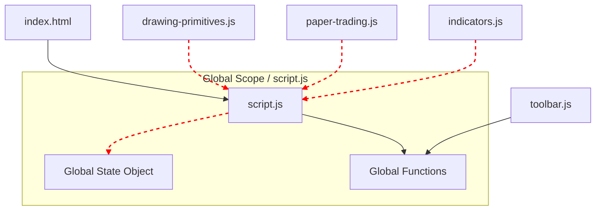

# Frontend Modularization - Refactoring Plan (Phase 0)

This document outlines a strategic plan for refactoring the frontend from a monolithic `script.js` into a modern, maintainable, and modular architecture.

**This is an analysis document only. No code has been modified.**

## 1. Current State Analysis

The frontend is a highly-performant vanilla JavaScript application. However, its architecture is monolithic, with the majority of logic, state management, and subsystem orchestration centralized in `script.js`. This tight coupling makes maintenance, debugging, and feature development increasingly difficult.

### Key Architectural Challenges
- **Global Scope Pollution**: Numerous functions, state variables, and manager instances (`state`, `drawingManager`, `paperTrading`) reside in the global scope, creating implicit dependencies between different parts of the application.
- **Monolithic `script.js`**: This file serves as the application's core, managing everything from chart rendering and WebSocket connections to UI event handling and business logic for multiple subsystems.
- **Implicit Dependencies**: Modules communicate by calling global functions (e.g., `window.setDrawingTool`) or by directly mutating the global `state` object, rather than through explicit interfaces or events.
- **High Risk of Circular Dependencies**: Because `script.js` is the central hub, extracting any single piece of logic (e.g., the `DrawingManager`) into its own module would immediately create a circular dependency, as both `script.js` and the new module would need to reference each other.

## 2. Global State & Variables

The following global variables and state containers are the primary sources of coupling:

- **`state` object**: The monolithic global state container holding chart data, UI state, WebSocket instances, and more.
- **`CONFIG` object**: Global configuration constants.
- **`window.drawingManager`**: Global instance of the `DrawingManager` class.
- **`window.paperTrading`**: Global instance of the `PaperTrading` module.
- **`TimeUtils` object**: Global utility for time formatting.
- **Global Functions**: `savePrimitiveDrawing`, `restoreDrawings`, `setDrawingTool`, `clearAllDrawings`, etc.
- **`localStorage` Keys**: `trading-dashboard-layout`, `trading-dashboard-drawings`, `paper-account`, etc., act as a persistent global state layer.

## 3. Major Subsystems

The application can be divided into these logical subsystems:

- **Core App**: `script.js` (initialization, grid management, main event loop).
- **Chart Engine**: `script.js` (Lightweight Charts initialization, data sync, legend).
- **Drawing Engine**: `drawing-primitives.js` + `DrawingManager` class in `script.js`.
- **Toolbar**: `toolbar.js`.
- **Paper Trading**: `paper-trading.js` and its related class files.
- **Indicator Engine**: Calculation functions in `indicators.js` and rendering logic in `script.js`.
- **Market Replay**: Logic contained entirely within `script.js`.
- **Backtesting**: Frontend rendering logic in `script.js`.
- **UI Components**: Sidebars, modals, and tickers managed by functions in `script.js`.
- **Data Layer**: API fetching and WebSocket handling in `script.js`.

## 4. Dependency Graph

The current dependency structure is a classic "star" pattern with `script.js` at its center, making it a monolith.


*Red dashed lines indicate tight coupling to the global scope and `script.js`.*

## 5. Recommended Refactoring Plan

A phased approach is recommended to minimize risk. The core principle is to introduce a central **Event Bus** (or Pub/Sub system) early on. This will allow modules to communicate indirectly, breaking the hard dependencies on `script.js`.

### Phase 1: Foundation & Utilities (Low Risk)

1.  **Introduce an Event Bus**: Create a simple `EventBus.js` module. This is the most critical first step. It will allow decoupled communication.
    ```javascript
    // EventBus.js
    class EventBus {
      constructor() { this.events = {}; }
      on(event, listener) { /* ... */ }
      emit(event, data) { /* ... */ }
    }
    window.eventBus = new EventBus();
    ```
2.  **Extract `TimeUtils`**: Move the `TimeUtils` object from `script.js` into its own `utils/time.js` file. This is a stateless utility and is very low risk.
3.  **Extract `CONFIG`**: Move the `CONFIG` object into `config.js`.
4.  **Refactor Toolbar**: Modify `toolbar.js` to `emit` an event (e.g., `eventBus.emit('tool-selected', { tool: 'trendline' })`) instead of calling `window.setDrawingTool()` directly. Update `script.js` to `listen` for this event.

### Phase 2: State Management & API Layer (Medium Risk)

1.  **Create a State Manager**: Create a `state.js` module. Move the `state` object into this module and expose it. This begins to centralize state access.
2.  **Create an API Service**: Create an `services/api.js` module. Move all `fetch` calls from `script.js` into this service. The service will handle API requests and can `emit` events with the fetched data (e.g., `eventBus.emit('history-loaded', { chartId, data })`).
3.  **Create a WebSocket Service**: Create `services/websockets.js` to manage the Binance and Hyperliquid connections. This service will listen for `price-update` events and `emit` them on the main event bus.

### Phase 3: Core Subsystem Extraction (High Risk)

This is the most complex phase and requires careful dependency injection.

1.  **Extract `DrawingManager`**:
    -   Move the `DrawingManager` class and related functions (`savePrimitiveDrawing`, `restoreDrawings`) into `features/drawing/DrawingManager.js`.
    -   The `DrawingManager` will need access to the chart instance and the global state. This can be passed during its instantiation (`new DrawingManager(chart, state)`).
    -   It should listen for `tool-selected` events from the Event Bus.

2.  **Extract `PaperTrading`**:
    -   This module is already well-encapsulated in its own files.
    -   The main task is to refactor its interaction points. Instead of `script.js` calling `paperTrading.updatePrice()`, the paper trading module should listen for a `price-update` event on the Event Bus.
    -   When a trade is executed, it should `emit` an event like `trade-executed` so other parts of the app (like the chart) can react.

3.  **Extract `IndicatorEngine`**:
    -   Create `features/indicators/IndicatorEngine.js`.
    -   Move all indicator calculation functions (`calculateSMA`, `calculateRSI`, etc.) and rendering logic into this module.
    -   The engine can be instantiated per-chart and will listen for `history-loaded` and `price-update` events to perform its calculations.

### Phase 4: Final Modularization (Medium Risk)

1.  **Create a `Chart` Class**: Create a `components/Chart.js` module. This class will encapsulate a single chart pane's entire lifecycle, including its Lightweight Charts instance, its own `IndicatorEngine`, and its `DrawingManager`.
2.  **Refactor `script.js` to a `GridManager`**: With all subsystems extracted, `script.js` can be refactored into a `GridManager.js`. Its sole responsibilities will be:
    -   Managing the grid layout.
    -   Instantiating and destroying `Chart` objects.
    -   Listening to global UI events (like the chart count selector).

## 6. Summary of Key Areas

### High-Risk Modules
-   **`DrawingManager`**: Tightly coupled with chart instances, the global `state.drawings`, and user input events. Extraction requires careful dependency injection.
-   **`IndicatorEngine`**: Depends heavily on `chartData.cachedData` and requires access to every series object on the chart for rendering.
-   **`Chart` Class**: The final abstraction that ties many moving parts together.

### Low-Risk Modules
-   **`TimeUtils`**: A stateless, pure utility.
-   **`toolbar.js`**: Can be easily decoupled with an event bus.
-   **`CONFIG`**: A simple constants file.

### Shared State to Decouple
-   `state.charts`: Each `Chart` instance should manage its own state.
-   `state.drawings`: Should be managed by a dedicated `DrawingState` service that the `DrawingManager` interacts with.
-   `state.liveStream`, `state.hlWs`, `state.binanceWs`: Should be encapsulated within a `WebSocketService`.

### Global Event Listeners to Refactor
-   `document.addEventListener("DOMContentLoaded", initializeApp)`: This will become the entry point that instantiates the `GridManager` and other core services.
-   `document.addEventListener("visibilitychange", ...)`: This logic should be moved into the relevant services (e.g., WebSocket service might pause on hidden).
-   All `onclick` and `onchange` listeners for global UI elements (theme toggle, chart count, etc.) should be managed by a dedicated `UIManager` module.

### Files to Leave Untouched Initially
-   **`drawing-primitives.js`**: This file contains the low-level rendering logic for custom drawings. It has few external dependencies and can be left as-is until the `DrawingManager` is fully extracted.
-   **`paper-trading.js` and its dependencies**: While it needs to be integrated with the event bus, the internal class structure (`PaperAccount`, `PaperPositions`, `PaperHistory`) is already well-organized and does not need immediate refactoring.

## 7. Conclusion

The path to a modular frontend involves systematically breaking down `script.js`, introducing an event bus to decouple communication, and encapsulating each subsystem into its own module with clear responsibilities. By following the phased approach outlined above, we can manage risk and incrementally improve the codebase's health and maintainability.

---

**Next Step**: Begin **Phase 1** by creating `EventBus.js` and extracting the `TimeUtils` and `CONFIG` objects.